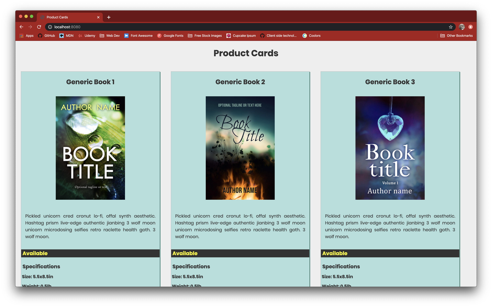

# product-cards

## Description
This project is an exploration of vanilla css focusing on using flexbox and understanding its capabilities. We wrote all code from stratch, and were tasked with making all cards have a uniform look on the page, which displays products that are available on this website. The cards display a title for the item, an image, a description, specifications, multiple price points, and the item's availability.

## Screenshots

## Instructions / How to Run
1. Clone down this repo
2. Make sure you have http-server installed via npm. If not get it here [HERE](https://www.npmjs.com/package/http-server)
3. On your command line run `hs -p 9999`
4. In your browser go to `http://localhost:9999`